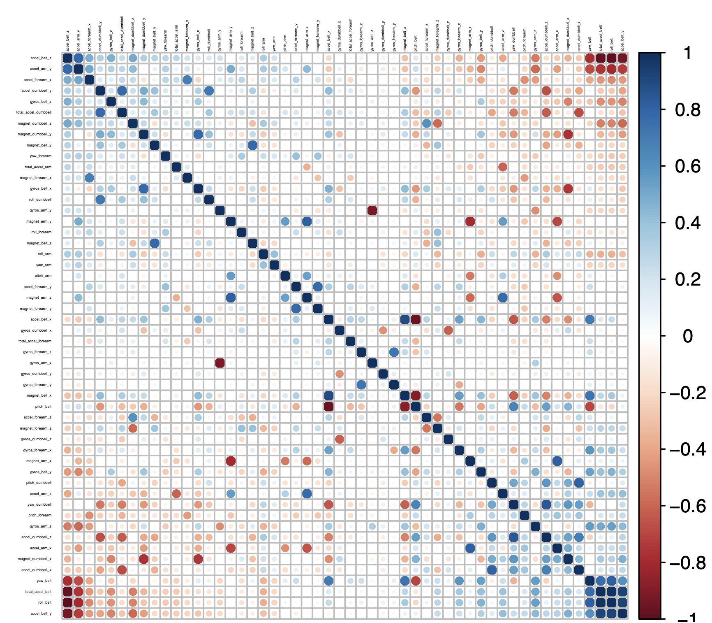

# coursera_practical_ML_project
John Hopkins University Data Science class / Practical Machine Learning Final Project

# Prediction Assignment Course Project

## Executive Summary

#### One thing that people of the quantified self movement regularly 
#### do is to quantify how much of a particular activity they do, but 
#### they rarely quantify how well they do it. In this project, the 
#### goal will be to use data from accelerometers on the belt, forearm, 
#### arm, and dumbell of 6 participants. They were asked to perform 
#### barbell lifts correctly and incorrectly in 5 different ways. The 
#### goal of the project is to predict the manner in which they 
#### did the exercise. 

## Libraries

#### library(caret)
#### library(corrplot)
#### library(randomForest)
#### library(rattle)
#### library(rpart)
#### library(rpart.plot)

## Load data

#### First load the CSV and make sure to remove all white spaces,
#### NaN's, etc.

## Data cleaning

#### Data cleaning, by removing all columns that contain 
#### NAs or empty values. Also, I remove the first columns
#### that contain data, that won't help the predoction (see data 
#### summary in appendix 1 - i.e. timestamp data).

## Create validation set

#### Create a validation data set, which consists of 
#### 20% of the training data set

## Correlation Matrix

## Cross Validation

#### set up cross validation to compare models

## Models

#### I am using the Decision Tree, Random Forest and the
#### Gradiant Boosting models, which I first train
#### with the train data and validate with the 
#### validation set.
#### After training the models, I create a confusion
#### matrix for each of them and compare the 'Accuracy' 
#### metric.
#### Random Forest is able to have the most accurate 
#### prediction.

 